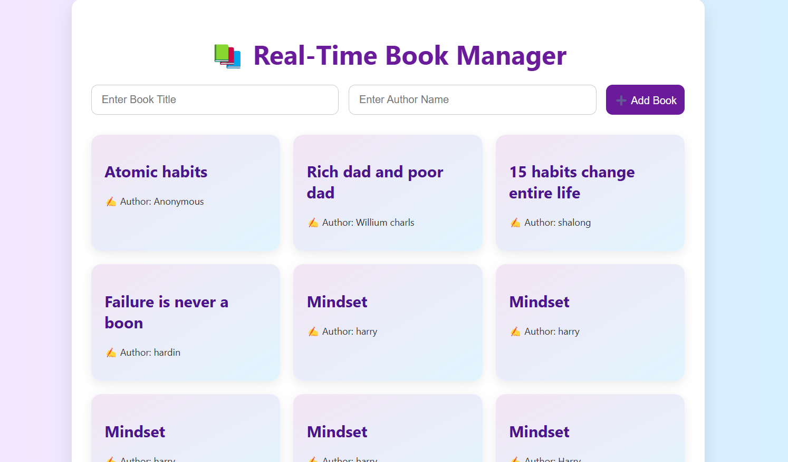
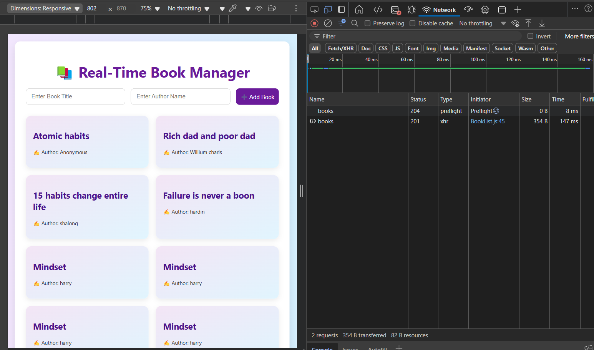
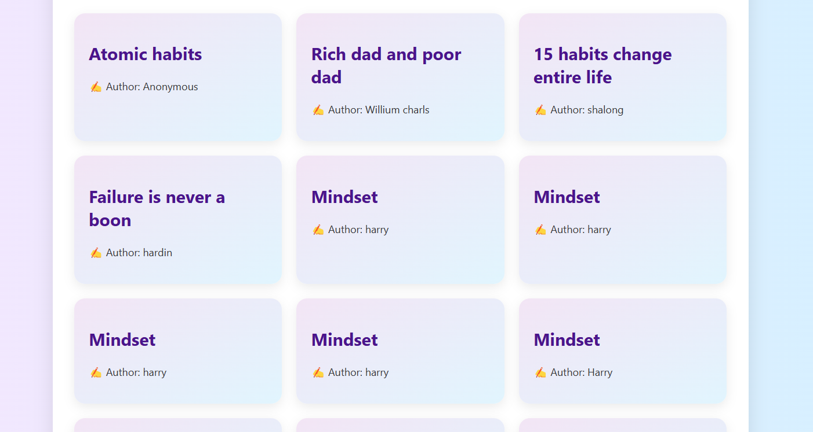
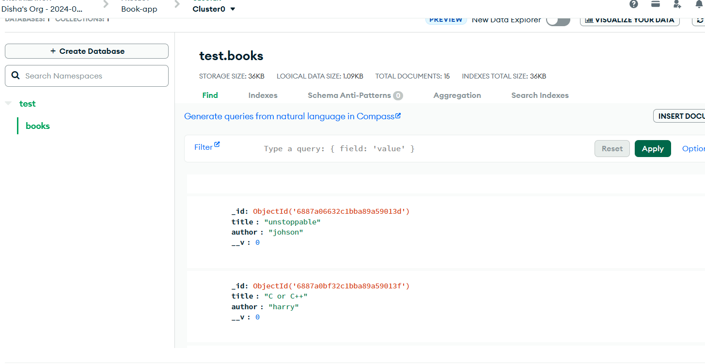
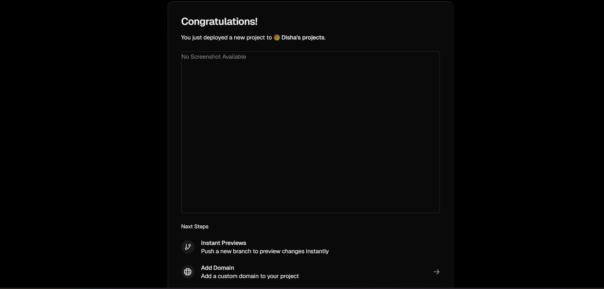
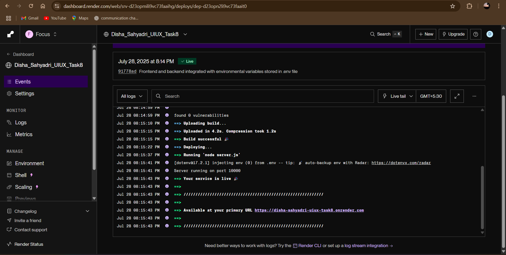

# 📚 Real-Time Book Management App — UI/UX - Task 8

**Candidate Name:** Disha Shetty  
**College:** Sahyadri College of Engineering & Management  
**Internship Task:** MatreComm – React Developer (Task 8)

---

## 📝 Overview


This full-stack application enhances the book management system by enabling **real-time updates** using **Socket.IO**. Any new addition or update to the book list is reflected instantly across all connected clients—eliminating the need to refresh the page manually.

---

## ⚙️ Tech Stack

| Layer     | Technology                         |
| --------- | ---------------------------------- |
| Frontend  | React, CSS, Socket.IO Client       |
| Backend   | Node.js, Express, Socket.IO Server |
| Database  | MongoDB                            |
| Real-time | WebSockets via Socket.IO           |
| Testing   | Postman, Web tools                 |

---

## 🚀 Features

- 🔄 Real-time book list synchronization
- 📘 Dynamic UI updates on book addition/update
- 🌐 Multi-client update broadcasting
- ⚠️ WebSocket error & reconnect handling
- 🔍 Tested on local multi-client setup

---

### 1. 📖 Book List UI (Before Adding)



### 2. 📝 Add Book Form



### 3. ⚡ Real-Time Update in Action



---

## 🔄 Real-Time Functionality

- **Socket Events Used:**

  - `book-added`
  - `book-updated`

- **frontend Logic:**

  - On load: WebSocket connects and listens.
  - On receiving event: React state is updated instantly.

- **Backend Logic:**
  - Emits relevant events via Socket.IO when books are created or modified.

---

## 🔧 Implementation Breakdown

### Backend (`/backend`)

- Configured **Socket.IO** with Express server.
- Emits WebSocket events on book data changes.

### Frontend (`/frontend`)

- Initializes WebSocket connection with `useEffect`.
- Listens and reacts to real-time events.
- Clean UI updates on receiving events.

---

## 🧪 Testing Summary

| Scenario                                  | Result                |
| ----------------------------------------- | --------------------- |
| Add a book in one tab, reflect in another | ✅ Success            |
| Update book in one client, all updated    | ✅ Success            |
| Multiple clients connected                | ✅ Stable sync        |
| Disconnect and reconnect scenario         | ✅ Handled gracefully |

---

## 🚀 Deployment

- Recommended platforms:
  - **Backend:** Render
  - **Frontend:** Vercel
- WebSocket-friendly deployment with proper CORS and server configurations.

---

### 1. 📖 Book List UI (Before Adding)



### 2. 📝 Add Book Form



### 3. ⚡ Real-Time Update in Action



## 🛠 How to Run Locally

```bash
# Step 1: Clone the repository
git clone https://github.com/Dishashetty546/Disha_Sahyadri_UIUX_Task8.git
cd ./

# Step 2: Install and start backend
cd backend
npm install
npm start

# Step 3: Install and start frontend
cd frontend
npm install
npm start
```

---

## 🙏 Thank You

This real-time application demonstrates my ability to build scalable, interactive full-stack systems using modern web technologies.

---

## 📫 Contact

- **Name:** Disha
- **Email:** [dishashetty546@gmail.com]
